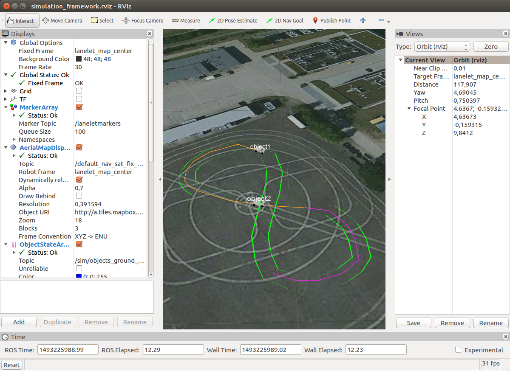

# ROS Simulation Framework

This is the main readme of the ROS Simulation Framework, developed jointly within the [Priority Program 1835 "Cooperatively Interacting Automobiles"](http://www.coincar.de/) of the German Science Foundation (DFG) and within the [TechCenter A-Drive](http://tcadrive.de/) funded by the state of Baden-Württemberg.

The readme of this meta package, containing settings for a working example of the framework, can be found in the [README_initialization.md](README_initialization.md).

## Installation
Installation requires Linux as operating system. The framework is developed and tested under [Ubuntu 16.04](http://releases.ubuntu.com/16.04/).

#### Prerequisites
In order to use the framework, you need to install the following packages (installable via `apt install`)
* ROS (see http://wiki.ros.org/ROS/Installation)
  * `ros-kinetic-desktop-full`
  * `ros-kinetic-geodesy`
  * `ros-kinetic-tf2-geometry-msgs`
* Catkin Tools (see http://catkin-tools.readthedocs.io/en/latest/index.html)
  * `python-catkin-tools`
* System Libraries
  * `libpugixml-dev`
  * boost and eigen are installed with ROS

#### Required repositories

External Dependencies
* [automated_driving_msgs](https://github.com/fzi-forschungszentrum-informatik/automated_driving_msgs): messages used by the framework
* [mrt_cmake_modules](https://github.com/KIT-MRT/mrt_cmake_modules): cmake helper
* [rosparam_handler](https://github.com/cbandera/rosparam_handler): handling ROS parameters
* [rviz_satellite](https://github.com/gareth-cross/rviz_satellite): plugin for visualization of satellite images

Parts of this Framework

* general functionality:
  * simulation_initialization_ros_tool (this): settings and launchfiles
  * simulation_management_ros_tool: core functionality (localization, time and initialization management)
  * simulation_only_msgs: additional messages
  * simulation_utils: all utility libraries
  * simulation_utils_ros_tool: small utility nodes
  * sim_lanelet: lanelet map library

* sample vehicle:
  * sim_sample_perception_ros_tool
  * sim_sample_prediction_ros_tool
  * sim_sample_planning_ros_tool
  * sim_sample_actuator_ros_tool
  * sim_sample_communication_ros_tool

* visualization:
  * desired_motion_rviz_plugin_ros
  * lanelet_rviz_plugin_ros
  * motion_state_rviz_plugin_ros
  * object_state_array_rviz_plugin_ros

* see the readme of the respective package for details

## Usage
#### 1a) Set up and build the workspace yourself
* set up a catkin workspace
  * ` $ mkdir catkin_ws && cd catkin_ws`
  * `catkin_ws$ wstool init`
  * `catkin_ws$ mkdir src && cd src`
* clone all repositories into the `src` folder of this workspace
  * `catkin_ws/src$ git clone <adress of repository>`
* build the workspace
  * `catkin_ws/src$ cd ..`
  * `catkin_ws$ catkin build`
* source the build-files
  * `catkin_ws$ source devel/setup.bash`

or
#### 1b) Use the script
* do the above steps by starting
  * ` $ ./setup_workspace.sh`

and then
#### 2) Launch the framework
* start the simulation framework by launching the main launchfile:
  * `catkin_ws$ roslaunch simulation_initialization_ros_tool _whole_framework.launch`
  * see [README_initialization.md](README_initialization.md) for details about how the parts of the framework are launched

#### 3) Contribute
* fork this meta package and modify the launchfiles/settings to simulate (parts of) your vehicle
* fork other components or create new ones to modify and/or extend the functionality

## License
Contact the maintainer of the respective package for license issues.
