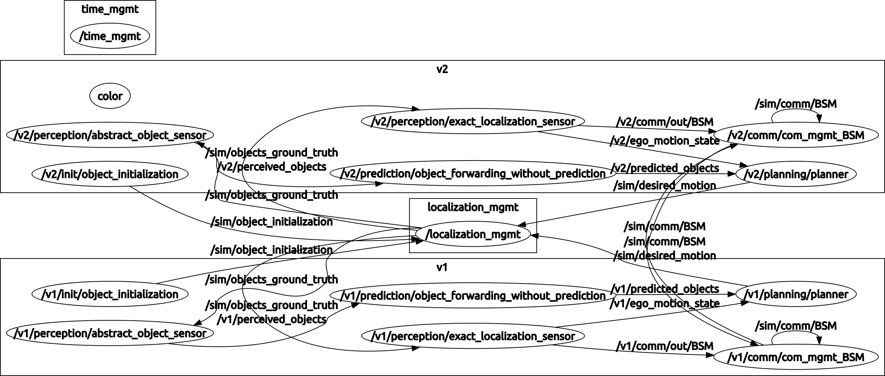

# simulation_initialization_ros_tool
Initialization of all parts of the simulation framework. **Launchfiles only!**

## Installation
* this package is part of the simulation framework
* see [main readme](README.md) for installation and more details

## Usage
* launch the file `launch/_whole_framework.launch`

#### Launchfile Overview

```
simulation_initialization_ros_tool
    │
    ├── simulation_management_ros_tool *
    │   │
    │   ├── time_mgmt
    │   ├── localization_mgmt
    │   └── object_initialization
    │
    └── objects
        │
        ├── vehicle1
        │   ├── perception *
        │   ├── prediction *
        │   ├── planning *
        │   └── communication *
        │
        └── vehicle2
            ├── perception *
            ├── prediction *
            ├── planning *
            └── communication *
            
* = repositories (so they must include a launchfile which has to be called)
all other launchfiles inside here
```
* initialization launches the simulation management, the objects, dynamic reconfigure and rviz
* simulation management launches the single management nodes
* the objects launch their 4 modules and their initialization
* each of the modules launch their nodes

#### Settings Overview
* the rviz settings are saved in the file `launch/simulation_framework.rviz` and passed through to rviz from the launchfile
* other settings (e.g. for the localization management) are done entirely within the launchfiles
  * see the readme files of the respective package
  * ideally all parameters are defined in the top launchfile `launch/_whole_framework.launch` and passed through from there

#### ROS Graph

* for an interactive version of the graph create it yourself executing `$ rqt_graph` while the simulation is running

## License
This package is distributed under the 3-Clause BSD License, see [LICENSE](LICENSE).
